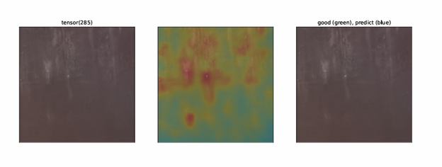
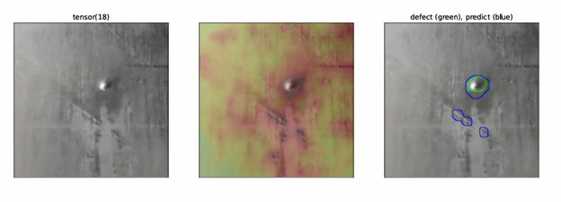
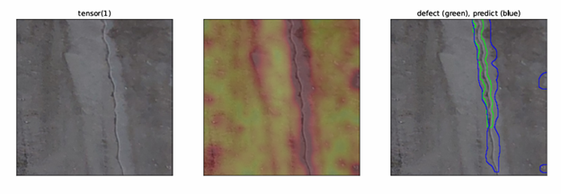
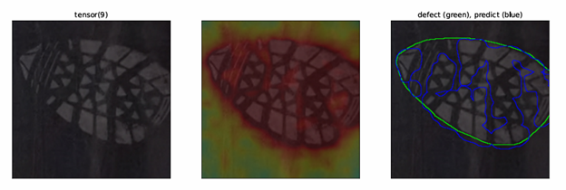

# Обнаружение дефектов конвейерных лент методом OrthoAD

**Дипломная работа** — Ласточкин Всеволод, СПбГЭУ, 2026

Адаптация метода [OrthoAD](https://github.com/jnhwkim/orthoad) (Kim et al., 2021) для задачи автоматического обнаружения дефектов на резинотканевых конвейерных лентах в условиях отсутствия размеченного набора дефектных изображений.

---

## Содержание

- [Описание задачи](#описание-задачи)
- [Что отличает от оригинального метода](#что-отличает-от-оригинального-метода)
- [Метод](#метод)
- [Структура репозитория](#структура-репозитория)
- [Установка](#установка)
- [Подготовка датасета](#подготовка-датасета)
- [Запуск обучения и инференса](#запуск-обучения-и-инференса)
- [Результаты экспериментов](#результаты-экспериментов)
- [Визуализация работы модели](#визуализация-работы-модели)
- [Ссылки](#ссылки)
- [Лицензия](#лицензия)

---

## Описание задачи

Резинотканевые конвейерные ленты в процессе эксплуатации могут иметь различные дефекты: трещины, пузыри, разрывы, расслоения. Ручной контроль состояния ленты трудоёмок и подвержен ошибкам оператора. Цель работы — автоматическое детектирование таких дефектов на изображениях участков ленты.

Ключевое ограничение постановки: **отсутствует размеченный набор дефектных изображений**, достаточный для обучения супервизорного классификатора. На предприятии доступны преимущественно фотографии исправных лент, а дефектные образцы немногочисленны и разнообразны. Поэтому задача формулируется как **несупервизорная сегментация аномалий** (unsupervised anomaly segmentation): по обучающей выборке из бездефектных изображений строится статистическая модель «нормы», и любое существенное отклонение от неё на тестовом изображении интерпретируется как потенциальный дефект.

Для решения этой задачи в работе адаптирован метод **OrthoAD** (Kim et al., 2021) — модификация подхода PaDiM на основе полуортогонального вложения локальных признаков предобученной свёрточной сети.

---

## Что отличает от оригинального метода

Оригинальная реализация [jnhwkim/orthoad](https://github.com/jnhwkim/orthoad) ориентирована на стандартный датасет [MVTec AD](https://www.mvtec.com/company/research/datasets/mvtec-ad) и предоставляет минимально необходимую инфраструктуру для воспроизведения результатов статьи. Адаптация под задачу контроля конвейерных лент потребовала:

**1. Собственного пайплайна подготовки данных** ([`data_preparation/`](data_preparation/)). Сырые фотографии ленты снимались на производстве в различных условиях освещения и под разными углами. Чтобы получить датасет, пригодный для обучения метода OrthoAD (он требует пространственного согласования образцов), потребовалось:

- разметить границы ленты на сырых фото в редакторе labelme;
- геометрически выровнять ленту перспективным преобразованием (OpenCV);
- нарезать выровненные полосы на квадратные патчи 512×512 с фильтрацией бликов и пустых областей;
- разбить полученные патчи на train/test с защитой от утечки данных по группам ROI;
- собрать финальный датасет в формате MVTec AD для совместимости с исходным кодом метода.

**2. Регистрации собственной категории `belt`** в `dataset.py` — наряду со стандартными категориями MVTec AD (bottle, carpet, leather, ...).

**3. Доработок самого метода** в `train.py`:

- замер скорости инференса в production-формате (`--benchmark-inference`) с прогревом и расчётом mean/median/p95/p99 латентности и FPS;
- поддержка прогона на датасетах без дефектных образцов (`--metric none`);
- параметризация порога визуализации $\tau_{vis}$ и читаемые имена выходных PDF;
- автоматическая инвалидация кэша при изменении состава датасета через fingerprint файлов;
- опциональная нормализация скоров по валидационной выборке (`--use-val-norm`), реализующая один из режимов, заложенных автором метода, но отключённых в оригинале;
- оптимизация: пропуск создания валидационного лоадера, если нормализация не используется.

**4. Подбор гиперпараметров** под конкретную задачу: значение размерности проекции $k$, выбор бэкбона, влияние режима нормализации — подробнее в разделе [Результаты](#результаты-экспериментов).

---

## Метод

### Постановка

Обучающая выборка состоит из RGB-изображений участков ленты, не содержащих дефектов:

$$I_n \in \mathbb{R}^{H_0 \times W_0 \times 3}, \quad n = 1, 2, \dots, N$$

Тестовое изображение, для которого требуется определить наличие, локализацию и степень аномальности дефекта:

$$I_t \in \mathbb{R}^{H_0 \times W_0 \times 3}$$

### Предобработка

Для каждого изображения выполняется предварительная обработка $P$:

$$X_n = P(I_n), \quad X_t = P(I_t)$$

включающая выделение области интереса (ROI — самой ленты на изображении) и геометрическое выравнивание. Это необходимо: метод строит локальные статистические модели признаков **отдельно для каждой пространственной позиции**, а это требует пространственного согласования образцов между собой. Описание процедуры подготовки см. в [`data_preparation/README.md`](data_preparation/README.md).

### Извлечение полномасштабных признаков

Пусть $\phi$ — предобученная свёрточная нейронная сеть (в работе используется **wide_resnet50_2** с весами, обученными на ImageNet). Из сети выбирается набор слоёв $\mathcal{L} = \{l_1, l_2, l_3\}$ — первые три блока сети (layer1, layer2, layer3). Для каждого обучающего изображения вычисляются карты признаков:

$$F_n^l = \phi_l(X_n) \in \mathbb{R}^{H_l \times W_l \times C_l}, \quad l \in \mathcal{L}$$

где $H_l, W_l$ — пространственное разрешение карты признаков на слое $l$; $C_l$ — число каналов слоя $l$; $\phi_l(X_n)$ — активации слоя $l$ для изображения.

Для wide_resnet50_2 при размере входного патча 512×512 размеры карт следующие:

$$F_n^{l_1} \in \mathbb{R}^{128 \times 128 \times 256}, \quad F_n^{l_2} \in \mathbb{R}^{64 \times 64 \times 512}, \quad F_n^{l_3} \in \mathbb{R}^{32 \times 32 \times 1024}$$

Использование сразу трёх слоёв даёт многомасштабность: ранние слои несут локальную текстурную информацию, более глубокие — семантическую.

### Объединение признаков

Карты с разных слоёв приводятся к общему разрешению $H \times W = 128 \times 128$ интерполяцией:

$$\tilde{F}_n^l = \mathcal{U}(F_n^l) \in \mathbb{R}^{H \times W \times C_l}$$

и конкатенируются вдоль канального измерения:

$$F_n = \text{Concat}_{ch}\{\tilde{F}_n^l\}_{l \in \mathcal{L}} \in \mathbb{R}^{H \times W \times d}, \quad d = \sum_{l \in \mathcal{L}} C_l$$

Для wide_resnet50_2 суммарная глубина признакового тензора:

$$d = 256 + 512 + 1024 = 1792, \quad F_n \in \mathbb{R}^{128 \times 128 \times 1792}$$

Для каждой пространственной позиции $(i, j) \in \{1, \dots, H\} \times \{1, \dots, W\}$ извлекается локальный вектор признаков:

$$f_n^{i,j} = F_n(i, j, :) \in \mathbb{R}^d$$

Этот вектор и есть единица анализа: модель строит отдельное статистическое описание нормы для каждой позиции $(i, j)$.

### Полуортогональное вложение

При $d = 1792$ прямое построение и обращение ковариационных матриц размера $d \times d$ для каждой из $H \cdot W = 16384$ позиций вычислительно неприемлемо — стоимость $\mathcal{O}(HW \cdot d^3)$ приводит к нехватке памяти даже на современных GPU. Поэтому локальные векторы проецируются в пространство меньшей размерности:

$$z_n^{i,j} = W^\top f_n^{i,j} \in \mathbb{R}^k, \quad k < d$$

В настоящей работе использовались значения $k \in \{100, 200, 300, 400, 500\}$, $W \in \mathbb{R}^{d \times k}$.

**Ключевая особенность метода OrthoAD** — выбор матрицы $W$ как полуортогональной:

$$W^\top W = I_k \in \mathbb{R}^{k \times k}$$

Такая матрица строится через QR-разложение случайной гауссовой матрицы $\Omega \in \mathbb{R}^{d \times k}$ с элементами, независимо распределёнными по $\mathcal{N}(0, 1)$. В коде это реализовано инициализацией `nn.init.orthogonal_(W)`.

Содержательный смысл: снижение размерности с сохранением геометрии признакового пространства — попарные расстояния между векторами в среднем сохраняются (свойство, восходящее к лемме Джонсона-Линденштраусса), но стоимость обращения ковариационных матриц снижается до $\mathcal{O}(HW \cdot k^3)$, что для $d/k \approx 6$ даёт ускорение примерно в $(d/k)^3 \approx 200$ раз.

Полуортогональное вложение (вместо случайного отбора каналов, как в методе PaDiM) — принципиальное отличие OrthoAD от предшественников и обеспечивает устойчивость к вырождению локальных ковариационных матриц.

### Оценка распределения нормы

Зафиксируем одну пространственную позицию $(i, j)$. По обучающей выборке доступны спроецированные локальные векторы:

$$z_1^{i,j}, z_2^{i,j}, \dots, z_N^{i,j} \in \mathbb{R}^k$$

Для каждой позиции вычисляются выборочное среднее и выборочная ковариационная матрица:

$$\mu_{ij} = \frac{1}{N} \sum_{n=1}^{N} z_n^{i,j} \in \mathbb{R}^k$$

$$\Sigma_{ij} = \frac{1}{N} \sum_{n=1}^{N} (z_n^{i,j} - \mu_{ij})(z_n^{i,j} - \mu_{ij})^\top + \varepsilon I_k$$

где $\varepsilon > 0$ — малый коэффициент регуляризации, обеспечивающий невырожденность ковариационной матрицы и численную устойчивость её обращения; $I_k$ — единичная матрица размера $k \times k$. Делитель $\frac{1}{N}$ соответствует определению в оригинальной статье и реализации метода.

В каждой позиции $(i, j)$ модель нормы — это многомерное нормальное распределение $\mathcal{N}(\mu_{ij}, \Sigma_{ij})$ в $k$-мерном пространстве проекций.

### Обработка тестового изображения

Для тестового изображения $I_t$ выполняется та же последовательность шагов: предобработка $X_t = P(I_t)$, извлечение многомасштабной карты признаков $F_t$, проекция в позиции $(i, j)$:

$$z_t^{i,j} = W^\top f_t^{i,j}$$

Локальная аномальность в позиции $(i, j)$ определяется как **квадрат расстояния Махаланобиса** от тестового вектора до распределения нормы той же позиции:

$$a_t^{i,j} = (z_t^{i,j} - \mu_{ij})^\top \Sigma_{ij}^{-1} (z_t^{i,j} - \mu_{ij})$$

Чем больше значение $a_t^{i,j}$, тем меньше тестовый локальный вектор похож на наблюдавшуюся в обучении норму в той же позиции.

### Построение карты аномальности

Все значения собираются в матрицу:

$$A_t = [a_t^{i,j}] \in \mathbb{R}^{H \times W}$$

Эта «сырая» карта имеет разрешение признакового тензора (128×128). Для совмещения с исходным изображением она увеличивается до исходного разрешения патча и сглаживается:

$$M_t(x, y) = \mathcal{G}(\mathcal{U}(A_t))$$

где $\mathcal{U}$ — оператор интерполяции до размера патча 512×512, $\mathcal{G}$ — оператор гауссова сглаживания. Сглаживание подавляет шум карты и улучшает визуальную интерпретацию.

### Решающие правила и метрики качества

На основе карты $M_t$ строятся решающие правила для трёх задач:

**1. Визуализация для оператора** — бинарная маска:

$$B_t(x, y) = \begin{cases} 1, & \text{если } M_t(x, y) \geq \tau_{vis} \\ 0, & \text{иначе} \end{cases}$$

В настоящей работе значение $\tau_{vis} = 15$ подобрано эмпирически по визуальной оценке результата. Подчеркнём, что $\tau_{vis}$ — порог **визуализации**, а не порог принятия решения о дефектности кадра: он влияет только на отображение, но не на численные метрики, основанные на ROC.

**2. Image-level детекция — метрика DET AUROC.** Скалярная оценка аномальности патча:

$$s(I_t) = \max_{x, y} M_t(x, y)$$

DET AUROC рассчитывается как площадь под ROC-кривой по парам $(s(I_t), y(I_t))$, где $y(I_t) \in \{0, 1\}$ — истинная метка патча. Метрика не зависит от выбора порога.

**3. Pixel-level сегментация — метрика SEG AUROC.** Оценивается насколько точно модель локализует дефект пространственно. Для каждого пикселя дефектного патча сопоставляются непрерывная оценка $M_t(x, y)$ и бинарная истинная метка $g(x, y) \in \{0, 1\}$ из ручной ground-truth маски. SEG AUROC — площадь под ROC-кривой по всем пикселям.

### Сводная схема модели

Итоговое отображение, реализуемое моделью на одном изображении:

$$\Phi: I_t \mapsto (M_t, B_t, s(I_t))$$

где $M_t$ — карта аномальности, $B_t$ — бинарная маска визуализации, $s(I_t)$ — скалярная оценка кадра.

**Алгоритм:**

1. Фиксированная CNN (wide_resnet50_2), предобученная на ImageNet.
2. Предобработка $X_n = P(I_n), X_t = P(I_t)$.
3. Объединённая многомасштабная карта признаков $F_n, F_t$.
4. Полуортогональная проекция $W^\top f$.
5. Оценка нормы $(\mu_{ij}, \Sigma_{ij})$ по обучающей выборке для каждой позиции.
6. Вычисление карты Махаланобиса на тесте.
7. Постобработка: интерполяция и гауссово сглаживание.
8. Решающие правила, выделение дефектной области, расчёт метрик.

---

## Об отсутствии автоматического порога принятия решения о дефектности кадра

В работе **не выполняется** автоматический подбор порога $\tau$ для бинарного решения «дефектный/исправный кадр». Это сознательное методологическое ограничение, и оно обосновано следующим:

- AUROC-метрики (DET и SEG) **не зависят от порога** — они оценивают качество ранжирования по всем возможным порогам сразу.
- Подбор порога для бинарного решения требует размеченной выборки, в которой эксперт-контролёр заранее определил, какой уровень дефектности **допустим** для эксплуатации ленты (некоторые дефекты допускаются ГОСТ 20-2018, некоторые — нет). Это **экспертное** заключение, основанное на нормативной документации и опыте.
- В рамках работы такого эксперта-разметчика привлечь не удалось; собственное «угадывание» порога противоречит производственной практике и могло бы дать ложное ощущение готовности модели к эксплуатации.

В готовой к внедрению системе подбор порога должен выполняться отдельным шагом на размеченной экспертной выборке, после чего метрики качества формулируются в терминах precision/recall/F1 при выбранном пороге. Это направление вынесено в перспективы развития работы.

---

## Структура репозитория

```
belt-orthoad-adaptation/
├── data_preparation/         Пайплайн подготовки датасета (см. отдельный README)
│   ├── make_roi.py
│   ├── make_roi_defects.py
│   ├── make_patches.py
│   ├── make_patches_defects.py
│   ├── split_dataset.py
│   ├── prepare_belt_mvtec_defect_test.py
│   └── README.md
├── dataset.py                Загрузка датасета MVTec AD + категория belt
├── model.py                  SpadeResNet, MahEvaluator (метод OrthoAD)
├── train.py                  Основной скрипт обучения и инференса
├── visualizer.py             Визуализация карт аномальности в PDF
├── functions.py              Вспомогательные функции
├── docs/images/              Иллюстрации для README
├── README.md                 Этот файл
└── README_original.md        README оригинального репозитория jnhwkim/orthoad
```

---

## Установка

Требуется Python 3.9+, CUDA-совместимая видеокарта (рекомендуется ≥ 8 ГБ VRAM).

```bash
# Клонировать репозиторий
git clone https://github.com/bzduuu/belt-orthoad-adaptation.git
cd belt-orthoad-adaptation

# Создать окружение conda
conda create -n orthoad python=3.9
conda activate orthoad

# Установить зависимости
pip install torch torchvision tqdm scikit-learn matplotlib opencv-python pillow scipy numpy
```

Для подготовки датасета дополнительно потребуется:

```bash
pip install labelme
```

---

## Подготовка датасета

Полный пайплайн подготовки описан в [`data_preparation/README.md`](data_preparation/README.md). Кратко:

1. **Сбор сырых фото** конвейерной ленты (бездефектных и дефектных).
2. **Разметка границ ленты** на сырых фото в labelme — четырёхугольник с меткой `belt`.
3. **Геометрическое выравнивание** — скрипты `make_roi.py` / `make_roi_defects.py` перспективным преобразованием «выпрямляют» ленту.
4. **Нарезка на патчи 512×512** — `make_patches.py` / `make_patches_defects.py`, с фильтрацией бликов и пустых областей.
5. **Разбиение train/test** — `split_dataset.py`, с защитой от утечки данных по группам ROI.
6. **Разметка дефектных областей** на патчах в labelme — полигон с меткой `defect`.
7. **Сборка финального датасета** в формате MVTec AD — `prepare_belt_mvtec_defect_test.py`.

Итоговая структура датасета (формат MVTec AD):

```
belt_mvtec_defect_test/
└── belt/
    ├── train/
    │   └── good/                   обучающие бездефектные патчи
    ├── test/
    │   ├── good/                   тестовые бездефектные патчи
    │   └── defect/                 тестовые дефектные патчи
    └── ground_truth/
        ├── good/                   заглушка
        └── defect/                 бинарные маски дефектов
```

---

## Запуск обучения и инференса

Базовый запуск:

```bash
python train.py \
  --dataroot <путь_к_датасету> \
  --dataset mvtecad --category belt \
  --model wide_resnet50_2 --k 300 \
  --metric auroc --batch-size 4 --workers 0 \
  --experiment <папка_для_результатов> \
  --report <папка_для_результатов>/results.out \
  --seed 1111
```

Полезные дополнительные флаги:

- `--benchmark-inference` — замерить скорость инференса (mean/median/p95/p99, FPS).
- `--benchmark-warmup 10` — число «прогревочных» батчей, исключённых из замера.
- `--use-val-norm` — нормализовать скоры по статистикам валидационной выборки.

После запуска в папке `<experiment>` появятся:

- `belt.pth` — карты предсказаний и метаданные;
- `results.out` — итоговая метрика;
- `benchmark_inference.txt` — детальные замеры скорости (при `--benchmark-inference`);
- `logs/` — текстовые логи.

---

## Результаты экспериментов

### Условия эксперимента

- **GPU**: NVIDIA GeForce RTX 5070, 12 ГБ VRAM, CUDA 13.2
- **Датасет**: belt_mvtec_defect_test (собственного приготовления). Train: 2302 патча, Test: 308 патчей (256 good + 52 defect).
- **Размер патча**: 512×512, передаётся в модель уменьшенным до 256×256 (`--scale half`).
- **Batch size**: 4, **seed**: 1111, **warmup**: 10 батчей.

### Сетка экспериментов

Прогнаны все комбинации: 2 бэкбона × {4 или 5 значений $k$} × {с/без `--use-val-norm`} = **18 запусков**.

| Бэкбон | $k$ | SEG AUROC | DET AUROC | Время на изображение, мс | FPS |
|---|---:|---:|---:|---:|---:|
| ResNet-18 | 100 | 0.9746 | 0.9724 | 2.25 | 444 |
| ResNet-18 | 200 | **0.9753** | 0.9723 | 2.42 | 414 |
| ResNet-18 | 300 | 0.9744 | 0.9711 | 2.81 | 356 |
| ResNet-18 | 400 | 0.9748 | 0.9730 | 3.25 | 308 |
| Wide ResNet-50-2 | 100 | 0.9707 | **0.9831** | 3.80 | 263 |
| Wide ResNet-50-2 | 200 | 0.9743 | 0.9741 | 4.05 | 247 |
| Wide ResNet-50-2 | 300 | 0.9749 | 0.9786 | 4.63 | 216 |
| Wide ResNet-50-2 | 400 | 0.9743 | 0.9765 | 5.17 | 193 |
| Wide ResNet-50-2 | 500* | 0.9748 | 0.9808 | 43.78 | 23 |

*При $k = 500$ для Wide ResNet-50-2 наблюдается резкая деградация скорости — см. ниже.

Поскольку при использовании `--use-val-norm` значения AUROC численно совпали с результатами без нормализации (с точностью до 4-го знака), в таблице приведены результаты без `val-norm`. Подробнее об этом ниже.

### Наблюдения

**1. Инвариантность AUROC к нормализации скоров.** Эксперименты с `--use-val-norm` дали значения SEG AUROC и DET AUROC, **численно совпадающие** с результатами без нормализации. Это математически ожидаемо: монотонная нормализация (вычитание среднего и деление на std) не меняет порядка скоров, а AUROC — мера качества ранжирования. Таким образом, нормализация полезна для **сопоставимости абсолютных значений** скоров между разными запусками, но не влияет на интегральные метрики качества.

**2. Деградация скорости при $k = 500$ на WRN50-2.** При значении $k = 500$ для Wide ResNet-50-2 время инференса возрастает с ~5 мс до ~45 мс на изображение (в 9 раз). Это связано с превышением доступного объёма видеопамяти при обращении тензора ковариаций размера $[H \cdot W, k, k]$: на этом значении $k$ операция перенаправляется на CPU, что и вызывает падение производительности. На практике оптимальные значения $k$ для WRN50-2 лежат в диапазоне 100–400.

**3. Лучшие конфигурации.**

| Цель | Конфигурация | DET AUROC | SEG AUROC | FPS |
|---|---|---:|---:|---:|
| Максимум по DET | WRN50-2, $k=100$ | **0.9831** | 0.9707 | 263 |
| Лучший баланс | WRN50-2, $k=300$ | 0.9786 | **0.9749** | 216 |
| Максимум скорости | ResNet-18, $k=100$ | 0.9724 | 0.9746 | 444 |

**4. ResNet-18 vs Wide ResNet-50-2.** Различия в SEG AUROC между бэкбонами невелики (~0.5%). ResNet-18 примерно в 3–4 раза быстрее при сопоставимом качестве сегментации, что делает его удачным выбором при ограничениях по вычислительным ресурсам. Wide ResNet-50-2 выигрывает в DET AUROC, особенно при $k = 100$.

**5. Стабильность качества сегментации.** SEG AUROC варьируется в узком диапазоне 0.9707–0.9753 (разброс < 0.5%) для всех 18 конфигураций. Карта аномальности, формируемая методом, оказалась устойчива к выбору гиперпараметров — основные различия проявляются на image-level (DET AUROC).

---

## Визуализация работы модели

Ниже приведены примеры работы обученной модели. Все примеры — на тестовых патчах, не предъявлявшихся при обучении.


*Рисунок 1. Пример бездефектного участка ленты. Карта аномальности равномерна по площади.*


*Рисунок 2. Пузырь резинотканевого покрытия. Модель локализует область с высокой степенью точности.*


*Рисунок 3. Трещина. Карта аномальности следует контуру дефекта.*


*Рисунок 4. Отпечаток обуви — не дефект ленты, но распознаётся моделью как аномалия. Иллюстрирует ограничение метода: он чувствителен ко всем отклонениям от обучающего распределения, в том числе к посторонним объектам.*


*Рисунок 5. Отпечаток руки — ещё один пример объекта, формально не являющегося дефектом, но идентифицируемого моделью как аномалия.*

---

## Ссылки

- **Оригинальная статья**: J.-H. Kim, D.-H. Kim, S. Yi, T. Lee. *Semi-orthogonal Embedding for Efficient Unsupervised Anomaly Segmentation* // arXiv:2105.14737, 2021.
- **Оригинальный репозиторий метода**: [jnhwkim/orthoad](https://github.com/jnhwkim/orthoad).
- **Метод-предшественник (PaDiM)**: T. Defard et al. *PaDiM: a Patch Distribution Modeling Framework for Anomaly Detection and Localization*, 2020.
- **Датасет MVTec AD**: [www.mvtec.com/company/research/datasets/mvtec-ad](https://www.mvtec.com/company/research/datasets/mvtec-ad)
- **ГОСТ 20-2018**: Ленты конвейерные резинотканевые. Технические условия.

---

## Лицензия

Проект распространяется под лицензией MIT — см. файл [`LICENSE`](LICENSE).

Метод OrthoAD разработан Kim et al. (2021) и распространяется автором под MIT License. Настоящая работа представляет собой адаптацию метода для задачи контроля конвейерных лент с сохранением авторских прав на оригинальный код.
